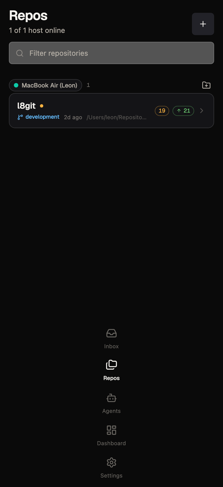
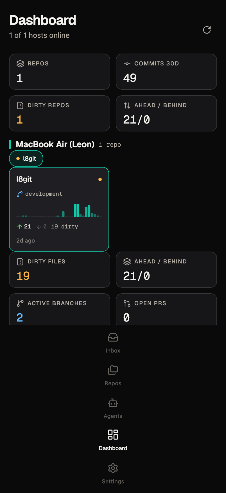
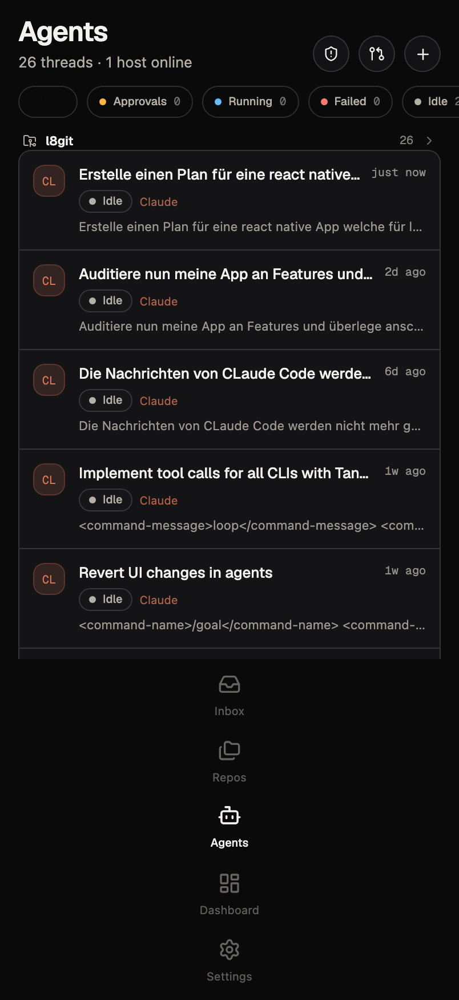

# l8git Remote — Mobile Companion

React-Native-App (Expo) unter `mobile/`, die sich über eine Ende-zu-Ende-verschlüsselte WebSocket-Verbindung mit einem oder mehreren l8git-Hosts verbindet und den vollen Funktionsumfang inklusive Agents-Tab bereitstellt.

Konzept und Wire-Protokoll: [CONCEPT.md](CONCEPT.md). Server-Interna: [SERVER-INTERNALS.md](SERVER-INTERNALS.md).

## Host starten

```bash
cd src-tauri
cargo build --features headless --bin l8gitd
./target/debug/l8gitd pair        # QR-Code + Pairing-JSON
./target/debug/l8gitd allow /pfad/zum/repo
./target/debug/l8gitd serve --port 8484 [--relay wss://...]
```

Die App scannt den QR-Code (oder fügt das JSON manuell ein) und verbindet sich per LAN oder Relay.

## Screenshots

Aufgenommen gegen einen laufenden `l8gitd` mit Live-Git-Daten:

| Repos | Dashboard | Agents |
|---|---|---|
|  |  |  |

- **Repos** — verbundener Host (grün), `l8git`-Repo auf `development`, Ahead/Behind- und Dirty-Zähler live vom Host.
- **Dashboard** — Übersichts-Kacheln (Repos, Commits 30d, Ahead/Behind), Commit-Aktivität als SVG-Sparkline, Sprach- und Branch-Statistik.
- **Agents** — kompletter Agents-Tab: Threads aller vier Provider (Codex/Claude/OpenCode/Cursor) mit Status-Chips, Approvals-Filter und Gruppierung pro Repo.
