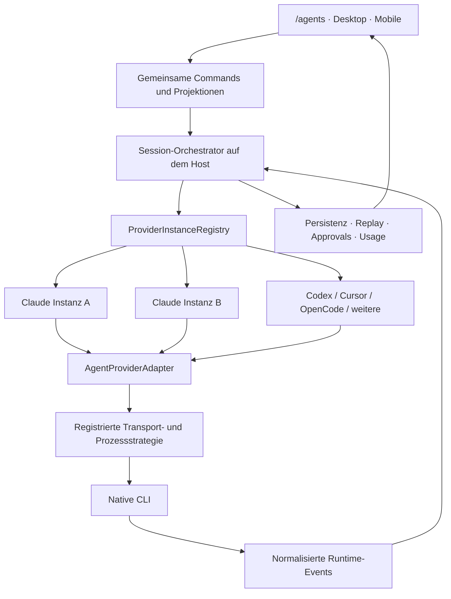

# /agents: vollständige Claude-Code-Integration und CLI-Provider-Pattern

Stand: 9. September 2026. **154 einzeln importierbare Ticketentwürfe in 17 Epics.** Sprache: Deutsch. Dies ist ein Implementierungsbacklog; in diesem Arbeitsschritt wurde keine Integration implementiert und kein Ticket extern veröffentlicht.

Ziel: Claude Code innerhalb von `/agents` über seine tatsächlich verfügbare CLI-/Runtime-Schnittstelle umfassend bedienen und weitere CLIs über ein gemeinsames Provider-Pattern anschließen. Vorhandene Claude-, Codex-, Cursor- und OpenCode-Funktionen sollen erhalten bleiben.

## Einstieg und Dateien

- [Bestandsanalyse und Übernahmeentscheidungen](ANALYSE.md): konkrete Ansatzpunkte und überprüfte Unterschiede.
- [Feature- und Protokollmatrix](FEATURE-MATRIX.md): Operations-, Event-, Control- und CLI-Zuordnung zu Tickets.
- [Referenztests und Regressionen](REFERENZTESTS.md): einzeln verlinkte t3code-Testfälle und vorgesehene Ticketabdeckung.
- [Referenzinventar](REFERENCE-INVENTORY.md): eine Zeile je Feature mit Referenz, l8git-Anker, Ticket und Status.
- [Upstream-Provenienz](PROVENANCE.md): Quelle, Commit, Lizenz und Regeln für Übernahmen aus t3code.
- [tickets.json](tickets.json): vollständige, unabhängige Tickettexte samt Prioritäten, Abhängigkeiten und vorgeschlagenen Labels.
- [tickets.csv](tickets.csv): dieselben Tickettexte als UTF-8-CSV für einen angepassten Tracker-Import.
- [manifest.json](manifest.json): Epic-Verzeichnis mit Dateinamen und Ticketzahlen.

GitHub/Jira-Import benötigt eine Zuordnung der Felder zum jeweiligen Tracker. `suggested_labels` sind Vorschläge, keine Behauptung bereits existierender Labels. IDs sind lokale Backlog-IDs und noch keine Issue-Nummern. Abhängigkeiten im Export müssen beim Import auf die erzeugten Issue-IDs abgebildet werden.

## Belegter Ausgangsstand

l8git-Basiscommit: `6359400921c625f63b51703388de78aa7f8da7d6`; berücksichtigt wurde zusätzlich der beim Lesen vorhandene, nicht saubere Arbeitsbaum. Insbesondere Composer, Agent-Route und mehrere Run-/Frage-/Kontextkomponenten waren bereits in Bearbeitung. Alle hier genannten Bestandsbefunde gelten für diesen gelesenen Arbeitsstand; vorhandene lokale Änderungen wurden nicht überschrieben.

t3code-Referenz: [6c583620ff7a](https://github.com/pingdotgg/t3code/blob/6c583620ff7ad3235b135af7107c0543467eecfa/apps/server/src/provider/Layers/ClaudeAdapter.ts), beim Erstellen aus dem öffentlichen Repository gelesen. Die Referenz verwendet **Claude Agent SDK und Effect**. l8git nutzt **Tauri/Rust und direkten JSONL-/Control-Transport**. Übernommen werden sollen Verhalten, Adaptergrenzen und Regressionserfahrungen. Eine wörtliche Übernahme von SDK-Code in Rust oder Browsercode ist kein funktionsfähiger Port. Diese Entscheidung wird in [PROV-01](01-prov.md#PROV-01) konkret festgehalten.

„Vollständig“ bedeutet hier: alle erfassten Flächen besitzen ein Ticket und ein prüfbares Abnahmeziel. Es bedeutet weder, dass jedes Feature im Bestand fehlt, noch dass jede neue CLI-Version jede Oberfläche unterstützt. t3code bietet beispielsweise für `prompt_suggestion` selbst keine UI; die gewünschte Anzeige ist eine Erweiterung. Unbelegte Funktionen bleiben Versions-/Capability-Prüfungen. Ein Upgrade der Referenz ist ein neuer, ausdrücklich dokumentierter Abgleich.

## Architekturvorschlag

- **Treiber** beschreibt Implementierung, Metadaten, Konfigurationsschema und Factory.
- **Instanz** besitzt Account-/Konfigurationsidentität, Adapter, Modellkatalog und Lebenszyklus. Zwei Claude-Accounts sind zwei Instanzen desselben Treibers.
- **Session/Thread** bindet Host, Instanz und Arbeitsverzeichnis; l8git-ID und native Session-ID bleiben getrennt.
- **Capabilities** bestimmen verfügbare Aktionen einschließlich Grund bei Nichtverfügbarkeit. UI und Backend verwenden denselben fachlichen Vertrag.
- **Orchestrator** verarbeitet neutrale Events. Native Nachrichten und besondere CLI-Semantik verbleiben im Adapter.
- **Transport** behält Tauri-/Host-Prozesshoheit. Ein SDK-Sidecar wird nur nach dokumentiertem Kompatibilitätsnachweis als begründete Alternative eingeführt.

## Prioritäten und Reihenfolge

54 Tickets sind P0, 73 P1 und 27 P2. Priorität ist Dringlichkeit, **keine topologische Reihenfolge und keine Streichliste**. P0 kann vorbereitende P1-Tickets benötigen; die ausgewiesenen Abhängigkeiten sind maßgeblich. P2 gehört zum gewünschten Vollumfang, insbesondere kleine Bedienfunktionen und neue native CLI-Flächen.

1. Referenz/ADR, Identitäten, Verträge, Registry und Fixtures: `PROV-01..07`, `QA-01..02`, erste `RUN`-/`SEC`-Tickets.
2. Host-Runtime, Instanzen, Migration, native Eventnormalisierung, sicherer Send-/Stop-/Resume-Pfad.
3. Permissions, Fragen, Planmodus, Tools, Attachments, Usage und Multi-Instance-/Reconnect-Verhalten.
4. MCP/Skills/Hooks/Plugins, Subagents/Workflows, Worktrees/Reviews sowie Remote-/Mobile-Parität.
5. Kleine UX-Funktionen und zusätzliche native CLI-Flächen; danach Plattform-, Race- und Performance-Abnahme.
6. [QA-08](15-qa.md#QA-08) prüft den Gesamtumfang. Seine Abhängigkeiten erreichen transitiv **alle übrigen Tickets**; ein offenes P2 verschwindet damit nicht aus der Abschlussprüfung.

## Epics

| Epic | Bereich | Tickets |
| --- | --- | ---: |
| [PROV](01-prov.md) | Provider-Verträge und erweiterbare Architektur | 12 |
| [RUN](02-run.md) | Prozesse, Transport und Wiederverbindung | 10 |
| [SET](03-set.md) | Einrichtung, Accounts und Instanzkonfiguration | 8 |
| [CHAT](04-chat.md) | Composer und Session-Verwaltung | 12 |
| [EVT](05-evt.md) | Streaming, Tools und vollständige Ereignisabbildung | 12 |
| [ASK](06-ask.md) | Permissions, Planfreigaben und Rückfragen | 9 |
| [HIST](07-hist.md) | History, Resume, Fork und Kontext-Checkpoints | 8 |
| [MOD](08-mod.md) | Modelle, Thinking und Laufzeitoptionen | 7 |
| [USE](09-use.md) | Kontext, Token, Kosten und Limits | 8 |
| [EXT](10-ext.md) | Skills, MCP, Hooks, Plugins und native Erweiterungen | 13 |
| [TASK](11-task.md) | Subagents, Aufgaben und Hintergrundprozesse | 8 |
| [GIT](12-git.md) | Repository-, Worktree- und Review-Anbindung | 6 |
| [UX](13-ux.md) | Desktop, Remote und Mobile-Parität | 6 |
| [SEC](14-sec.md) | Bestehende Sicherheitsgrenzen und Datenintegrität | 6 |
| [QA](15-qa.md) | Paritätsnachweis, Regressionen und Auslieferung | 8 |
| [DETAIL](16-detail.md) | Kleine Bedienfunktionen aus t3code | 11 |
| [CLI](17-cli.md) | Weitere native CLI-Flächen und explizite Versionsentscheidungen | 10 |

## Gemeinsame Definition of Done

Ein Umsetzungsticket ist abgeschlossen, wenn seine Kriterien im Zielcode erfüllt sind, passende Tests bzw. nachvollziehbare manuelle Belege vorliegen und die Capabilitymatrix den tatsächlichen Supportstand zeigt. Bestehende Funktionen werden zuerst geprüft und weiterverwendet. Ein Mocktest allein beweist keine tatsächliche CLI-Unterstützung.

Features ohne native Unterstützung erhalten eine dokumentierte Alternative oder bleiben als begründete Lücke offen. Eine bloße `unsupported`-Antwort erfüllt einen geforderten Funktionsausbau nicht automatisch. Sicherheitsgrenzen, Authentifizierung, bestehende Provider und Nutzerdaten müssen erhalten bleiben. Neu übernommener t3code-Code erhält einen passenden Herkunfts-/Lizenznachweis.

Für dieses **Dokumentationspaket** wurden Ticketzahlen, IDs, Export-Konsistenz, lokale/Referenz-Dateipfade, interne Links und der azyklische Abhängigkeitsgraph geprüft. Produkt-E2E, CLI-Verhalten und Implementierungstests wurden dadurch nicht ausgeführt; sie sind Teil der Tickets.

## Alle Tickets

| ID | Ticket | Priorität | Einordnung |
| --- | --- | --- | --- |
| [PROV-01](01-prov.md#PROV-01) | Übernahmeentscheidung CLI-Protokoll versus Agent SDK dokumentieren | P0 | T3-Referenz / Architektur |
| [PROV-02](01-prov.md#PROV-02) | DriverKind, InstanceId, ThreadId und native SessionId trennen | P0 | T3-Referenz / Ausbau |
| [PROV-03](01-prov.md#PROV-03) | Gemeinsamen AgentProviderAdapter definieren | P0 | T3-Referenz / Ausbau |
| [PROV-04](01-prov.md#PROV-04) | Eine Driver-Registry statt paralleler Provider-Listen | P0 | l8git-Bestand / Ausbau |
| [PROV-05](01-prov.md#PROV-05) | Provider-Instanzen mit eigener Konfiguration verwalten | P0 | T3-Referenz / Ausbau |
| [PROV-06](01-prov.md#PROV-06) | Capability-Vertrag mit Gründen und Versionsgrenzen | P0 | T3-Referenz / Ausbau |
| [PROV-07](01-prov.md#PROV-07) | Kanonische Commands und Runtime-Events versionieren | P0 | T3-Referenz / Ausbau |
| [PROV-08](01-prov.md#PROV-08) | Gemeinsamen Session-Orchestrator und Projektionen aufbauen | P0 | T3-Referenz / Ausbau |
| [PROV-09](01-prov.md#PROV-09) | Bestehende Daten auf Standardinstanzen migrieren | P0 | T3-Referenz / Ausbau |
| [PROV-10](01-prov.md#PROV-10) | Bestehende vier Adapter schrittweise hinter die Registry migrieren | P0 | l8git-Bestand / Ausbau |
| [PROV-11](01-prov.md#PROV-11) | Neutralen Erweiterungstest mit fünftem Test-Treiber liefern | P1 | Architektur-Erweiterung |
| [PROV-12](01-prov.md#PROV-12) | Provider-SPI und Portierungsleitfaden dokumentieren | P1 | Architektur-Erweiterung |
| [RUN-01](02-run.md#RUN-01) | Backend-Prozessfabriken pro Treiber registrieren | P0 | l8git-Bestand / Ausbau |
| [RUN-02](02-run.md#RUN-02) | Claude-Binary zuverlässig auf allen Desktop-Plattformen auflösen | P0 | T3-Referenz / Ausbau |
| [RUN-03](02-run.md#RUN-03) | CLI-Version und Protokoll-Kompatibilität prüfen | P0 | Erweiterung / Versionsprüfung |
| [RUN-04](02-run.md#RUN-04) | Initialize-Handshake und Readiness absichern | P0 | l8git-Bestand / Ausbau |
| [RUN-05](02-run.md#RUN-05) | Control-Requests mit Timeout, Cancellation und Cleanup versehen | P0 | l8git-Bestand / Ausbau |
| [RUN-06](02-run.md#RUN-06) | JSONL-Framing und begrenzte Puffer robust machen | P0 | l8git-Bestand / Ausbau |
| [RUN-07](02-run.md#RUN-07) | Graceful Stop und Prozessbaum-Cleanup implementieren | P0 | T3-Referenz / Ausbau |
| [RUN-08](02-run.md#RUN-08) | Replay, Deduplizierung und Lückenerkennung durchziehen | P0 | T3-Referenz / Ausbau |
| [RUN-09](02-run.md#RUN-09) | Headless- und Mehrclient-Sessionbesitz definieren | P0 | Architektur-Erweiterung |
| [RUN-10](02-run.md#RUN-10) | Idle-Reaper, Limits und Backpressure einführen | P1 | T3-Referenz / Ausbau |
| [SET-01](03-set.md#SET-01) | Provider-Einrichtung mit eindeutigem Readiness-Status | P1 | T3-Referenz / Ausbau |
| [SET-02](03-set.md#SET-02) | Claude-Login und Logout instanzgebunden ausführen | P0 | T3-Referenz / Ausbau |
| [SET-03](03-set.md#SET-03) | CLAUDE_CONFIG_DIR und Account-Isolation unterstützen | P0 | T3-Referenz / Ausbau |
| [SET-04](03-set.md#SET-04) | Instanz-Umgebungsvariablen mit Secret-Verweisen speichern | P0 | T3-Referenz / Ausbau |
| [SET-05](03-set.md#SET-05) | Binary, Startoptionen und wirksame Settings bearbeiten | P1 | T3-Referenz / Ausbau |
| [SET-06](03-set.md#SET-06) | Router und Cloud-Backends als Claude-Presets abbilden | P2 | Erweiterung / Versionsprüfung |
| [SET-07](03-set.md#SET-07) | CLI-Update nur über nachgewiesenen Installationsbesitzer | P2 | T3-Referenz / Ausbau |
| [SET-08](03-set.md#SET-08) | Diagnosebericht und Support-Export redigieren | P1 | T3-Referenz / Ausbau |
| [CHAT-01](04-chat.md#CHAT-01) | Neue Threads eindeutig an Repo und Provider-Instanz binden | P0 | l8git-Bestand / Ausbau |
| [CHAT-02](04-chat.md#CHAT-02) | Laufenden Turn gezielt steuern oder Nachricht einreihen | P0 | T3-Referenz / Ausbau |
| [CHAT-03](04-chat.md#CHAT-03) | Abbrechen und nach Abbruch fortsetzen | P0 | T3-Referenz / Ausbau |
| [CHAT-04](04-chat.md#CHAT-04) | Entwürfe pro Host, Instanz und Thread erhalten | P1 | l8git-Bestand / Ausbau |
| [CHAT-05](04-chat.md#CHAT-05) | Datei-, Ordner- und Codebereich-Erwähnungen anschließen | P1 | l8git-Bestand / Ausbau |
| [CHAT-06](04-chat.md#CHAT-06) | Bilder über Datei, Einfügen und Drag-and-drop senden | P1 | T3-Referenz / Ausbau |
| [CHAT-07](04-chat.md#CHAT-07) | Allgemeine Datei- und Dokumentanhänge einführen | P1 | T3-Referenz / Ausbau |
| [CHAT-08](04-chat.md#CHAT-08) | CLI-Befehle und App-Slash-Commands eindeutig routen | P1 | l8git-Bestand / Ausbau |
| [CHAT-09](04-chat.md#CHAT-09) | Prompt-Vorschläge und Folgeaktionen darstellen | P2 | l8git-Bestand / Ausbau |
| [CHAT-10](04-chat.md#CHAT-10) | Thread-Liste mit Suche, Pins, Archiv und Titel vervollständigen | P1 | l8git-Bestand / Ausbau |
| [CHAT-11](04-chat.md#CHAT-11) | Nachrichten kopieren, exportieren und gezielt erneut senden | P2 | l8git-Bestand / Ausbau |
| [CHAT-12](04-chat.md#CHAT-12) | Tastatur, Fokus, Sprache und Zugänglichkeit abschließen | P1 | l8git-Bestand / Ausbau |
| [EVT-01](05-evt.md#EVT-01) | Claude-Rohereignisse zentral normalisieren | P0 | T3-Referenz / Ausbau |
| [EVT-02](05-evt.md#EVT-02) | Text-Deltas und Assistant-Snapshots ohne Duplikate zusammenführen | P0 | T3-Referenz / Ausbau |
| [EVT-03](05-evt.md#EVT-03) | Provider-gelieferte Thinking-Blöcke darstellen | P1 | T3-Referenz / Ausbau |
| [EVT-04](05-evt.md#EVT-04) | Partielle Tool-Argumente zuverlässig rekonstruieren | P0 | T3-Referenz / Ausbau |
| [EVT-05](05-evt.md#EVT-05) | Tool-Ergebnisse, Fortschritt und Fehler vollständig zeigen | P1 | T3-Referenz / Ausbau |
| [EVT-06](05-evt.md#EVT-06) | Bash- und Terminal-Ausführung mit Statusdetails rendern | P1 | l8git-Bestand / Ausbau |
| [EVT-07](05-evt.md#EVT-07) | Dateiänderungen einschließlich Notebook-Edits normalisieren | P1 | l8git-Bestand / Ausbau |
| [EVT-08](05-evt.md#EVT-08) | Read, Suche, Web und Bildansicht differenziert darstellen | P1 | T3-Referenz / Ausbau |
| [EVT-09](05-evt.md#EVT-09) | TodoWrite und Task-Abhängigkeiten als Schritteliste abbilden | P1 | T3-Referenz / Ausbau |
| [EVT-10](05-evt.md#EVT-10) | Hook-Lebenszyklus und CLI-Mitteilungen zuordnen | P1 | T3-Referenz / Ausbau |
| [EVT-11](05-evt.md#EVT-11) | Terminale Ergebnisse und Fehlerursachen korrekt priorisieren | P0 | T3-Referenz / Ausbau |
| [EVT-12](05-evt.md#EVT-12) | Streaming-Rendering unter Last stabil halten | P1 | l8git-Bestand / Ausbau |
| [ASK-01](06-ask.md#ASK-01) | Claude-Permission-Modi ohne falsche Sandbox-Zusage abbilden | P0 | l8git-Bestand / Ausbau |
| [ASK-02](06-ask.md#ASK-02) | Modell- und Permission-Änderungen auf betroffene Session begrenzen | P0 | l8git-Bestand / Ausbau |
| [ASK-03](06-ask.md#ASK-03) | Approve-once, Reject und Session-Freigabe abbilden | P0 | T3-Referenz / Ausbau |
| [ASK-04](06-ask.md#ASK-04) | Permission-Änderungen und zusätzliche Verzeichnisse bestätigen | P0 | T3-Referenz / Ausbau |
| [ASK-05](06-ask.md#ASK-05) | AskUserQuestion mit Einzelwahl, Mehrfachwahl und Freitext | P0 | T3-Referenz / Ausbau |
| [ASK-06](06-ask.md#ASK-06) | MCP-Elicitation einschließlich Abbruch und URL-Flow | P1 | l8git-Bestand / Ausbau |
| [ASK-07](06-ask.md#ASK-07) | ExitPlanMode als Planentscheidung behandeln | P0 | T3-Referenz / Ausbau |
| [ASK-08](06-ask.md#ASK-08) | Offene Requests bei Abort, Exit und Reconnect auflösen | P0 | T3-Referenz / Ausbau |
| [ASK-09](06-ask.md#ASK-09) | Approval-Inbox und Aufmerksamkeitsnavigation anbieten | P1 | l8git-Bestand / Ausbau |
| [HIST-01](07-hist.md#HIST-01) | Native Claude-History pro Instanz einlesen | P1 | l8git-Bestand / Ausbau |
| [HIST-02](07-hist.md#HIST-02) | Resume-Cursor dauerhaft und atomar persistieren | P0 | T3-Referenz / Ausbau |
| [HIST-03](07-hist.md#HIST-03) | Fehlende oder inkompatible Resume-Sessions behandeln | P0 | T3-Referenz / Ausbau |
| [HIST-04](07-hist.md#HIST-04) | Fork ab gewähltem Gesprächspunkt unterstützen | P1 | l8git-Bestand / Ausbau |
| [HIST-05](07-hist.md#HIST-05) | Gesprächs-Rollback getrennt von Datei-Restore implementieren | P1 | T3-Referenz / Ausbau |
| [HIST-06](07-hist.md#HIST-06) | Transkript-Persistenz und Export-Schemata versionieren | P0 | T3-Referenz / Ausbau |
| [HIST-07](07-hist.md#HIST-07) | Temporäre Sessions und gezielte Datenlöschung unterstützen | P2 | l8git-Bestand / Ausbau |
| [HIST-08](07-hist.md#HIST-08) | Externe Sessionänderungen und parallele Besitzer erkennen | P1 | Erweiterung / Versionsprüfung |
| [MOD-01](08-mod.md#MOD-01) | Dynamischen Modellkatalog pro Instanz bereitstellen | P1 | T3-Referenz / Ausbau |
| [MOD-02](08-mod.md#MOD-02) | Modellwechsel in laufender Session korrekt anwenden | P1 | T3-Referenz / Ausbau |
| [MOD-03](08-mod.md#MOD-03) | Effort, Thinking-Toggle und Thinking-Budget differenzieren | P1 | T3-Referenz / Ausbau |
| [MOD-04](08-mod.md#MOD-04) | Claude-Fast-Modus capability-basiert freischalten | P1 | T3-Referenz / Ausbau |
| [MOD-05](08-mod.md#MOD-05) | Eigene Modell-IDs, Aliase und Fallbacks erhalten | P1 | T3-Referenz / Ausbau |
| [MOD-06](08-mod.md#MOD-06) | System-Prompt, zusätzliche Regeln und Settings-Scope konfigurieren | P1 | Erweiterung / Versionsprüfung |
| [MOD-07](08-mod.md#MOD-07) | Turn-Budget, Max-Turns und strukturierte Ausgabe anbieten | P2 | Erweiterung / Versionsprüfung |
| [USE-01](09-use.md#USE-01) | Turn-Usage, Session-Summen und aktive Kontextgröße trennen | P0 | T3-Referenz / Ausbau |
| [USE-02](09-use.md#USE-02) | Kontextanzeige aus autoritativen Usage-Daten ableiten | P1 | T3-Referenz / Ausbau |
| [USE-03](09-use.md#USE-03) | Manuelle Kompaktierung mit Fortschritt anbieten | P1 | l8git-Bestand / Ausbau |
| [USE-04](09-use.md#USE-04) | Auto-Compact und Resume-Compact konfigurierbar machen | P1 | T3-Referenz / Ausbau |
| [USE-05](09-use.md#USE-05) | Kostenanzeige mit Herkunft und Instanzzuordnung ausbauen | P1 | l8git-Bestand / Ausbau |
| [USE-06](09-use.md#USE-06) | Rate-Limit-Ereignisse mit Reset und Wartezustand darstellen | P0 | T3-Referenz / Ausbau |
| [USE-07](09-use.md#USE-07) | Subscription- und Overage-Limits instanzgebunden anzeigen | P1 | T3-Referenz / Ausbau |
| [USE-08](09-use.md#USE-08) | Retries und Wiederaufnahme ohne doppelte Arbeit behandeln | P0 | T3-Referenz / Ausbau |
| [EXT-01](10-ext.md#EXT-01) | Skill-Discovery mit Scope, Frontmatter und Overrides prüfen | P1 | T3-Referenz / Ausbau |
| [EXT-02](10-ext.md#EXT-02) | Skill-Auswahl und Dispatch einschließlich Anhängen korrigieren | P1 | T3-Referenz / Ausbau |
| [EXT-03](10-ext.md#EXT-03) | Skills und benutzerdefinierte Commands bearbeiten | P1 | l8git-Bestand / Ausbau |
| [EXT-04](10-ext.md#EXT-04) | Custom Agents mit Modell, Tools und Scope verwalten | P1 | l8git-Bestand / Ausbau |
| [EXT-05](10-ext.md#EXT-05) | MCP-Inventar, Verbindung und Toolkatalog anzeigen | P1 | l8git-Bestand / Ausbau |
| [EXT-06](10-ext.md#EXT-06) | MCP-Konfiguration, OAuth und Reconnect vervollständigen | P1 | l8git-Bestand / Ausbau |
| [EXT-07](10-ext.md#EXT-07) | l8git-MCP-Tools in hostseitige Tool-Registry überführen | P0 | l8git-Bestand / Ausbau |
| [EXT-08](10-ext.md#EXT-08) | Hooks verwalten und Aktivierung nachvollziehbar machen | P1 | l8git-Bestand / Ausbau |
| [EXT-09](10-ext.md#EXT-09) | Plugin- und Marketplace-Lebenszyklus vervollständigen | P1 | l8git-Bestand / Ausbau |
| [EXT-10](10-ext.md#EXT-10) | CLAUDE.md, Rules und Memory kontextbezogen verwalten | P1 | Erweiterung / Versionsprüfung |
| [EXT-11](10-ext.md#EXT-11) | Capability-Sync und Import mit Vorschau erhalten | P1 | l8git-Bestand / Ausbau |
| [EXT-12](10-ext.md#EXT-12) | Browser-, Chart- und Barcode-Addons vollständig erhalten | P1 | l8git-Bestand / Bestandsschutz |
| [EXT-13](10-ext.md#EXT-13) | MCP-Prompts, Resources und weitere Protokollflächen prüfen | P2 | Erweiterung / Versionsprüfung |
| [TASK-01](11-task.md#TASK-01) | Subagent-Starts mit Elternbeziehung normalisieren | P1 | T3-Referenz / Ausbau |
| [TASK-02](11-task.md#TASK-02) | Subagent-Modell, Effort, Rolle und Titel korrekt anzeigen | P1 | T3-Referenz / Ausbau |
| [TASK-03](11-task.md#TASK-03) | Subagent-Fortschritt und Ausgabe getrennt darstellen | P1 | T3-Referenz / Ausbau |
| [TASK-04](11-task.md#TASK-04) | Task-Statuspatches und Abschluss vollständig abbilden | P1 | T3-Referenz / Ausbau |
| [TASK-05](11-task.md#TASK-05) | Workflow-Mitglieder, Phasen und Fanout darstellen | P1 | T3-Referenz / Ausbau |
| [TASK-06](11-task.md#TASK-06) | Subagent-Usage ohne doppelte Hauptturn-Kosten verbuchen | P1 | T3-Referenz / Ausbau |
| [TASK-07](11-task.md#TASK-07) | Hintergrundaufgaben einzeln anzeigen und stoppen | P1 | l8git-Bestand / Ausbau |
| [TASK-08](11-task.md#TASK-08) | Native Background-Sessions und Agent-Teams auf Anschluss prüfen | P2 | Erweiterung / Versionsprüfung |
| [GIT-01](12-git.md#GIT-01) | Worktree-Session mit korrektem CWD und Instanz starten | P1 | l8git-Bestand / Bestandsschutz |
| [GIT-02](12-git.md#GIT-02) | Live-Diffs und Dateizähler mit echten Änderungen synchronisieren | P1 | l8git-Bestand / Ausbau |
| [GIT-03](12-git.md#GIT-03) | Datei-Checkpoints und gezielten Restore anbieten | P1 | T3-Referenz / Ausbau |
| [GIT-04](12-git.md#GIT-04) | Review-Start und Findings an Thread und Diff binden | P1 | l8git-Bestand / Ausbau |
| [GIT-05](12-git.md#GIT-05) | Finish-Flow für Commit, Merge und Aufräumen erhalten | P1 | l8git-Bestand / Bestandsschutz |
| [GIT-06](12-git.md#GIT-06) | CLI-Textgenerierung für Titel und Git-Texte kapseln | P2 | T3-Referenz / Ausbau |
| [UX-01](13-ux.md#UX-01) | Provider-/Instanzpicker und Settingsflächen vereinheitlichen | P1 | T3-Referenz / Ausbau |
| [UX-02](13-ux.md#UX-02) | Agent-Übersicht und Benachrichtigungen pro Instanz ableiten | P1 | l8git-Bestand / Ausbau |
| [UX-03](13-ux.md#UX-03) | Remote-Protokoll um Instanzen und kanonische Events erweitern | P0 | l8git-Bestand / Ausbau |
| [UX-04](13-ux.md#UX-04) | Mobile-Chat mit voller Claude-Funktionsparität absichern | P1 | l8git-Bestand / Ausbau |
| [UX-05](13-ux.md#UX-05) | Offlinezustand und Snapshot-Aufholung verständlich machen | P1 | l8git-Bestand / Ausbau |
| [UX-06](13-ux.md#UX-06) | Onboarding und Bedienungsdokumentation aktualisieren | P1 | l8git-Bestand / Ausbau |
| [SEC-01](14-sec.md#SEC-01) | Repo-Trust und native Settings-Ausführung erhalten | P0 | l8git-Bestand / Bestandsschutz |
| [SEC-02](14-sec.md#SEC-02) | Pfad-, Repo- und Transportbesitz serverseitig prüfen | P0 | l8git-Bestand / Bestandsschutz |
| [SEC-03](14-sec.md#SEC-03) | Konfigurationsänderungen atomar und verlustfrei schreiben | P0 | l8git-Bestand / Bestandsschutz |
| [SEC-04](14-sec.md#SEC-04) | Sensitive Daten über Persistenz und Telemetrie redigieren | P0 | l8git-Bestand / Bestandsschutz |
| [SEC-05](14-sec.md#SEC-05) | Unbekannte Controls und nicht unterstützte Aktionen korrekt ablehnen | P0 | l8git-Bestand / Ausbau |
| [SEC-06](14-sec.md#SEC-06) | Untrusted Chat-/Tool-Inhalte sicher rendern und exportieren | P0 | l8git-Bestand / Bestandsschutz |
| [QA-01](15-qa.md#QA-01) | Referenzinventar für jedes CLI-/Adapter-Feature pflegen | P0 | Übernahme / Abnahme |
| [QA-02](15-qa.md#QA-02) | Sanitisierte Claude-Protokoll-Fixtures und Fake-CLI erstellen | P0 | T3-Referenz / Ausbau |
| [QA-03](15-qa.md#QA-03) | Gemeinsame Provider-Konformität und Migrationsregression prüfen | P0 | Architektur / Abnahme |
| [QA-04](15-qa.md#QA-04) | Claude-End-to-End-Abnahme auf unterstützten Plattformen durchführen | P0 | Übernahme / Abnahme |
| [QA-05](15-qa.md#QA-05) | Crash-, Race- und Performance-Abnahme durchführen | P1 | Übernahme / Abnahme |
| [QA-06](15-qa.md#QA-06) | Upstream-Provenienz und Lizenzhinweise für Übernahmen dokumentieren | P1 | Übernahme / Abnahme |
| [QA-07](15-qa.md#QA-07) | Gestufte Aktivierung und Rückfall auf vorhandene Adapter vorbereiten | P1 | Architektur / Abnahme |
| [QA-08](15-qa.md#QA-08) | Abschlussgate für vollständige Claude-Integration veröffentlichen | P1 | Übernahme / Abnahme |
| [DETAIL-01](16-detail.md#DETAIL-01) | Gesendete Prompts mit Pfeiltasten wiederaufrufen | P2 | T3-Referenz / Ausbau |
| [DETAIL-02](16-detail.md#DETAIL-02) | Prompt-Stash mit mehreren gespeicherten Entwürfen anbieten | P2 | T3-Referenz / Ausbau |
| [DETAIL-03](16-detail.md#DETAIL-03) | Assistant-Ausschnitte zitieren und zur Quelle springen | P2 | T3-Referenz / Ausbau |
| [DETAIL-04](16-detail.md#DETAIL-04) | Dateien direkt an Frageantworten anhängen | P1 | T3-Referenz / Ausbau |
| [DETAIL-05](16-detail.md#DETAIL-05) | Medien und erzeugte Dateien öffnen, speichern und teilen | P2 | T3-Referenz / Ausbau |
| [DETAIL-06](16-detail.md#DETAIL-06) | Screenshot-Kontext aus Desktop und Zwischenablage übernehmen | P2 | T3-Referenz / Ausbau |
| [DETAIL-07](16-detail.md#DETAIL-07) | Spracheingabe als bearbeitbaren Prompt anbieten | P2 | T3-Referenz / Versionsprüfung |
| [DETAIL-08](16-detail.md#DETAIL-08) | Thread-Reihenfolge, Snooze und Settle synchronisieren | P2 | T3-Referenz / Ausbau |
| [DETAIL-09](16-detail.md#DETAIL-09) | Threadsuche und Verweise über mehrere Hosts ergänzen | P2 | T3-Referenz / Ausbau |
| [DETAIL-10](16-detail.md#DETAIL-10) | PR-Verknüpfung und Projektdefaults für Agentthreads übernehmen | P2 | T3-Referenz / Ausbau |
| [DETAIL-11](16-detail.md#DETAIL-11) | Terminalausgabe als Promptkontext mitgeben | P2 | T3-Referenz / Ausbau |
| [CLI-01](17-cli.md#CLI-01) | Vollständiges natives Command-/Flag-Inventar versionieren | P1 | Erweiterung / Versionsprüfung |
| [CLI-02](17-cli.md#CLI-02) | Native Terminalübergabe und Diagnosemodi integrieren | P2 | Erweiterung / Versionsprüfung |
| [CLI-03](17-cli.md#CLI-03) | Native Chrome- und IDE-Anbindungen gezielt aktivieren | P2 | Erweiterung / Versionsprüfung |
| [CLI-04](17-cli.md#CLI-04) | MCP-Channels und asynchrone externe Eingaben anbinden | P2 | Erweiterung / Versionsprüfung |
| [CLI-05](17-cli.md#CLI-05) | Wiederkehrende Aufgaben und native Automatisierungen erfassen | P2 | Erweiterung / Versionsprüfung |
| [CLI-06](17-cli.md#CLI-06) | Native Remote-/Cloud-Sessions getrennt von l8git-Remote anbinden | P2 | Erweiterung / Versionsprüfung |
| [CLI-07](17-cli.md#CLI-07) | Self-hosted Runner und Gateway als Administrationsflächen einordnen | P2 | Erweiterung / Versionsprüfung |
| [CLI-08](17-cli.md#CLI-08) | Tool-Policies und exklusive MCP-/Plugin-Konfiguration anbieten | P1 | Erweiterung / Versionsprüfung |
| [CLI-09](17-cli.md#CLI-09) | Erweiterte Modell- und Output-Optionen inventarisieren | P2 | Erweiterung / Versionsprüfung |
| [CLI-10](17-cli.md#CLI-10) | Provider-Feedback mit Vorschau und explizitem Versand ermöglichen | P2 | l8git-Bestand / Versionsprüfung |
